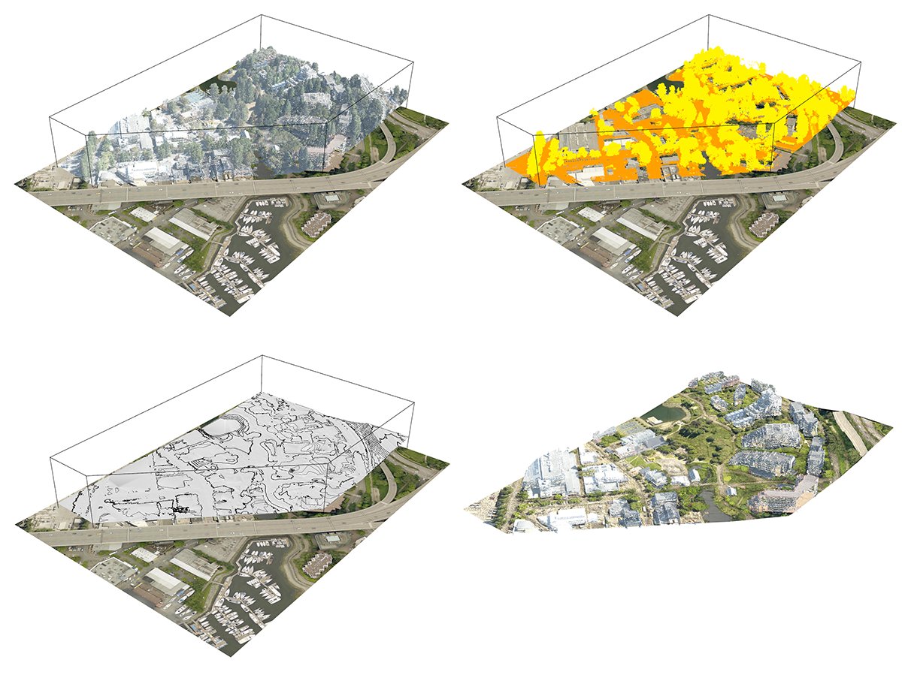

### SiteReader

*Site Reader is a suite of geoimagery processing and site modelling tools for Grasshopper.*

---
#### Current Functionality

* **Point Clouds**
    * Import .LAS and .LAZ lidar files directly through Grasshopper. 
    * Intuitive graphical components - users are able filter point clouds by feature, color, or other available metadata. 
    * Clouds are easily cropped with referenced BREPs or meshes. 
    * Users are able to upscale and downscale the amount of points in a cloud in a non-destructive manner.
    * Meshing Tool for ground / topo point clouds.
* **Raster Formats**
    * Site Reader is also able to accurately import and manipulate .ECW or .SID orthoimagery files.
    * Raster functionality driven by the corresponding [Python standalone](https://github.com/aarcThom/site-reader-py).

--- 

#### In Progress Functionality

* **Plant Generators**
    * Tree Generator
    * Vine Generator
    * Grass Generator
* **.SHP Imports**
* **DEM Imports**